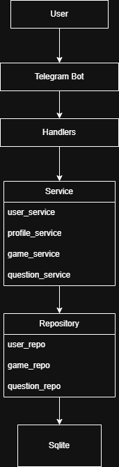
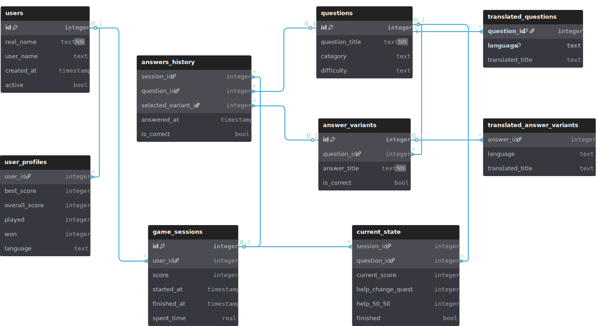

# SimpleQuiz Bot

## Overview 

The SimpleQuiz bot is a competitive Telegram-based quiz game where players answer randomly selected questions, earn points and scores with developable user statistics, and compete through a rating system. The project focuses on providing an engaging gameplay experience.                                                                                               

The system supports multilanguage, allowing questions and answer variants to be presented in different languages. Each game session is tracked independently, enabling score calculation, save every answer to persistent history, user statistics, and rating management.                                                                                                             

From a technical perspective, the project follows a layered architecture consisting of handlers, services, repositories, and a database layer. The application also includes structured logging, session management, and a normalized relational database schema designed.

## Features

- Quiz game play
- Translation support
- Help engine
- session tracking
- profile
- User statistics
- Leaderboars
- change language
- Logging

- Admin features:
- Control: deactivate, reactivate
- History: all users, one user
- All users profiles -viewer mode - moderate users

## Architecture

The project follows a layered architecture:

Handlers → Services → Repositories → Database

- Handlers: Telegram updates processing
- Services: business logic layer
- Repositories: database access layer



## Database Schema



## Project Structure

- application/
  - api/ → Telegram bot interface
  - cli/ → command-line interface

- handlers/ → request handlers (update processing)
- services/ → business logic
- repositories/ → database access layer

- database/ → DB setup and connection
- scripts/ → utility and admin scripts
- locales/ → multilingual support
- logs/ → application logging
- docs/ → architecture and database diagrams

## Installation

```bash
git clone <repo_url>
cd quiz_app
pip install -r requirements.txt
```

## Usage

## Run Telegram Bot

Entry point: [bot.py](Application/api/bot.py)

## Run CLI version

Entry point: [main.py](Application/cli/main.py)

## Logging

Application events are written to:

Entry point: [logs](logs/app.log)

The system uses three log levels

- INFO — normal application events
- WARNING — invalid actions or misuse
- ERROR — unexpected failures and exceptions

## Future Improvements

- Migration to asynchronous PTB (v20+)
- PostgreSQL support
- Docker deployment
- Advanced leaderboard system
- Additional languages
- Web dashboard for administration
- Performance optimization
